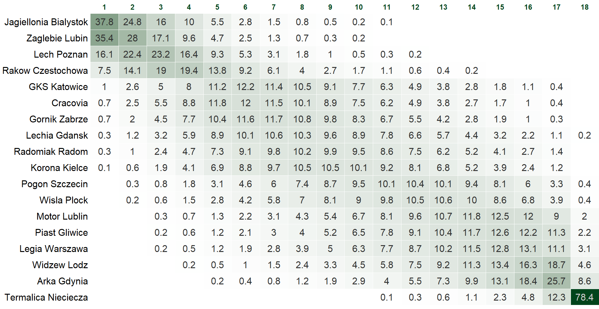
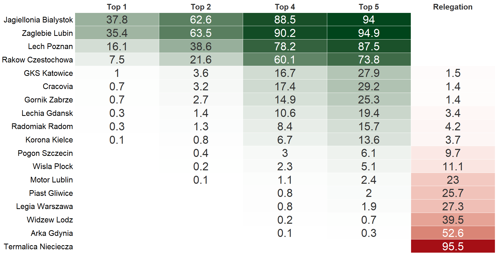

# Ekstraklasa 2025/2026 Season Simulation
### Based on the Dixon-Coles Statistical Model

This project aims to forecast the final standings of the Polish Ekstraklasa for the 2025/2026 season using an advanced probabilistic framework.

## 1. Theoretical Framework: The Dixon-Coles Model

The core of this simulation is the **Dixon-Coles model**, which assumes that the number of goals scored by the home team ($X$) and the away team ($Y$) follows a Poisson distribution, adjusted by a dependency parameter ($\tau$) to account for the correlation of low scores (0-0, 1-0, 0-1, 1-1).

The joint probability of a scoreline $(x, y)$ is defined as:
$$Pr(X_{i,j} = x, Y_{i,j} = y) = \tau_{\lambda,\mu}(x, y) \frac{\lambda^x \exp(-\lambda)}{x!} \frac{\mu^y \exp(-\mu)}{y!}$$

Where the attack strength ($\alpha$), defense strength ($\beta$), and home-field advantage ($\gamma$) determine the expected goals:
* **Home Team ($\lambda$):** $\lambda = \alpha_i \beta_j \gamma$
* **Away Team ($\mu$):** $\mu = \alpha_j \beta_i$

### Parameter Estimation and Constraints
The model parameters ($\alpha_i, \beta_i, \gamma, \rho$) are estimated by **maximizing the log-likelihood function**. To ensure the model is identifiable, the following constraints were applied:
* $\frac{1}{n} \sum_{i=1}^{n} \alpha_i = 1$
* $\frac{1}{n} \sum_{i=1}^{n} \beta_i = 1$.

Individual match outcomes were generated using the **Acceptance-Rejection sampling** method.

## 2. Methodology & Data Source

The simulation is powered by historical data from the following Ekstraklasa seasons: **2023/24, 2024/25, and the current 2025/26**.

### Time Decay Optimization
To reflect the evolving form of teams, a **time decay** component $\phi(t-t_k)$ was integrated into the likelihood function, giving more weight to recent matches.

**Optimization Process:**
1.  The dataset was split into **Training** and **Validation** sets.
2.  The decay parameter $\epsilon$ was tested within the range $[0, 0.03]$.
3.  The value that maximized the $S(\xi)$ function (Rank Probability Score equivalent) on the validation set was selected.
4.  In this study, the optimal value was found to be **$\epsilon = 0.03$**.
5.  After determining $\epsilon$, the final parameters were re-estimated using the combined dataset (Training + Validation).

## 3. Simulation & Results

After finalizing the parameters, the remainder of the 2025/2026 season was simulated **100,000 times**. Each iteration simulated every remaining fixture, generating a probability distribution for final points and league positions.

## Visualizations

### Probabilites for each position

---
*Note: The source code for the simulation is available in the repository folders.*
